# PAGSIBOL VILLAGE PH2 4B EAST HOA Portal - User Manual

Generated: June 24, 2026
Last revised: August 24, 2026 (payroll completion verified in PR #166; production availability requires confirmed deployment)

This manual explains how officers and homeowners use the portal. Screenshots were captured from the current clean database, so many tables show empty states until real homeowners, bills, payments, employees, and records are added.

## 1. Website Access

Public link:

```text
https://pagsibol-hoa.tail2abf68.ts.net/login
```

Local host link:

```text
http://localhost:3000/login
```

Use the email address and password issued by the HOA administrator.

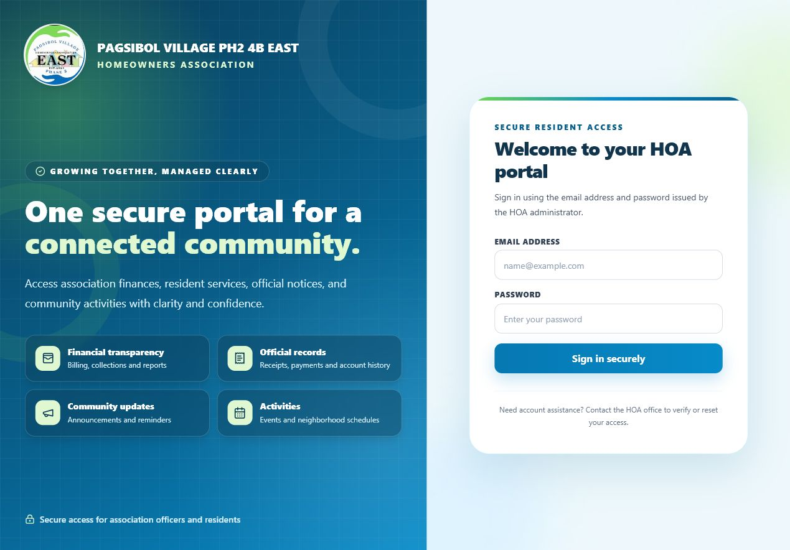

## 2. Sign In and Sign Out

1. Open the login page.
2. Enter the issued email address.
3. Enter the password.
4. Click **Sign in securely**.
5. Use **Log out** in the sidebar when finished.

Friendly reminders:

- Do not share passwords.
- Ask the HOA office to reset access if a homeowner cannot sign in.
- Change default or temporary passwords before sharing the site publicly.

## 3. System Admin Guide

System Admin can configure organization identity and connection settings.

Open **System settings**.

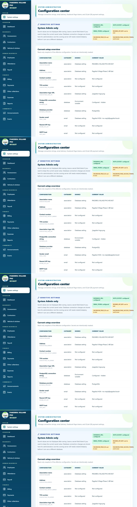

Use this page to configure:

- Association logo, name, address, contact number, and TIN number
- Database connection notes
- Email sender and Resend API key
- Facebook Page ID and Page access token
- Messenger placeholder token
- GCash account name, mobile number, QR image URL, instructions, and webhook secret

Association profile updates are reflected on website pages, forms, receipts, reports, payslips, and email templates.

## 4. Admin Dashboard

The dashboard summarizes the financial position of the association.

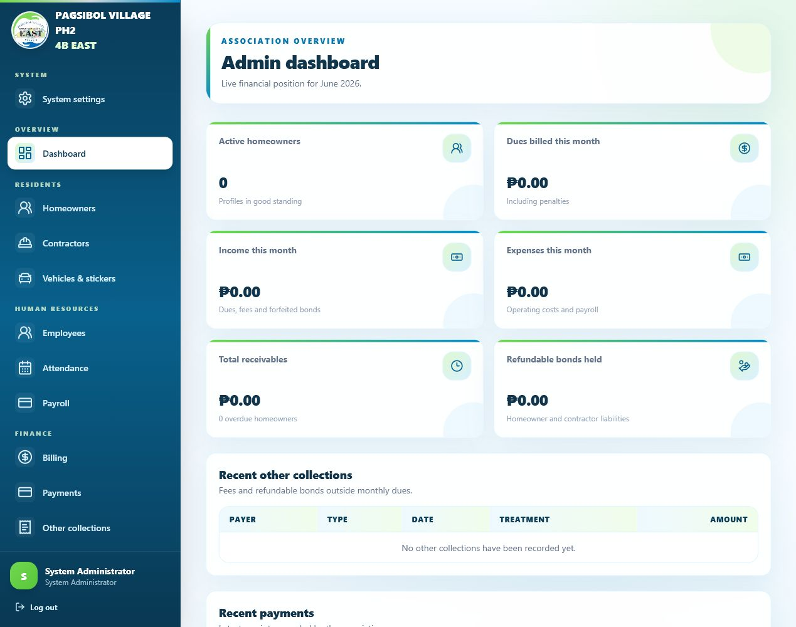

Cards show:

- Active homeowners
- Dues billed this month
- Income this month
- Expenses this month
- Total receivables
- Refundable bonds held

Recent tables show other collections and payments when records exist.

## 5. Homeowner Management

Open **Homeowners** to search, view, edit, or delete homeowner profiles.

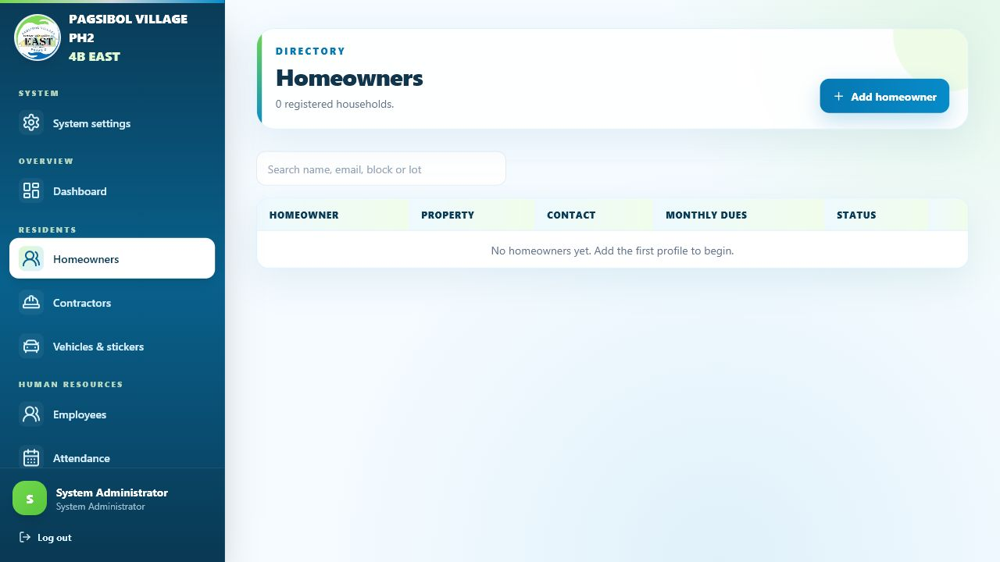

To add a homeowner:

1. Open **Homeowners**.
2. Click **Add homeowner** or open `/admin/homeowners/new`.
3. Enter name, email, phone, address, block, lot, Messenger ID, status, and monthly dues amount.
4. Save the record.
5. Give the homeowner their login details.

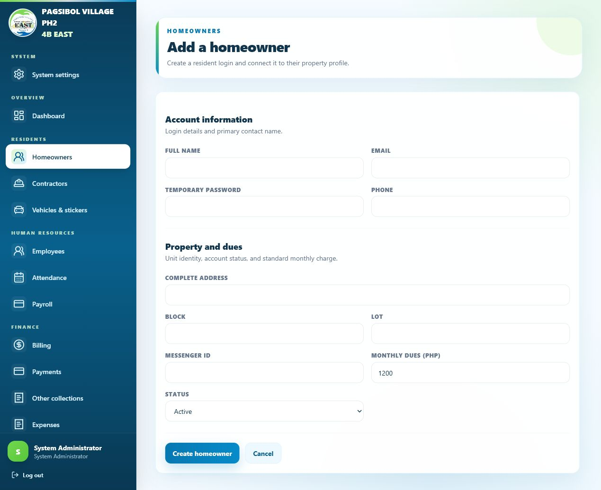

Important:

- Each homeowner has one login user.
- Block and lot must be unique.
- Homeowners can only see their own profile, billing, and payments.

## 6. Billing Management

Open **Billing**.

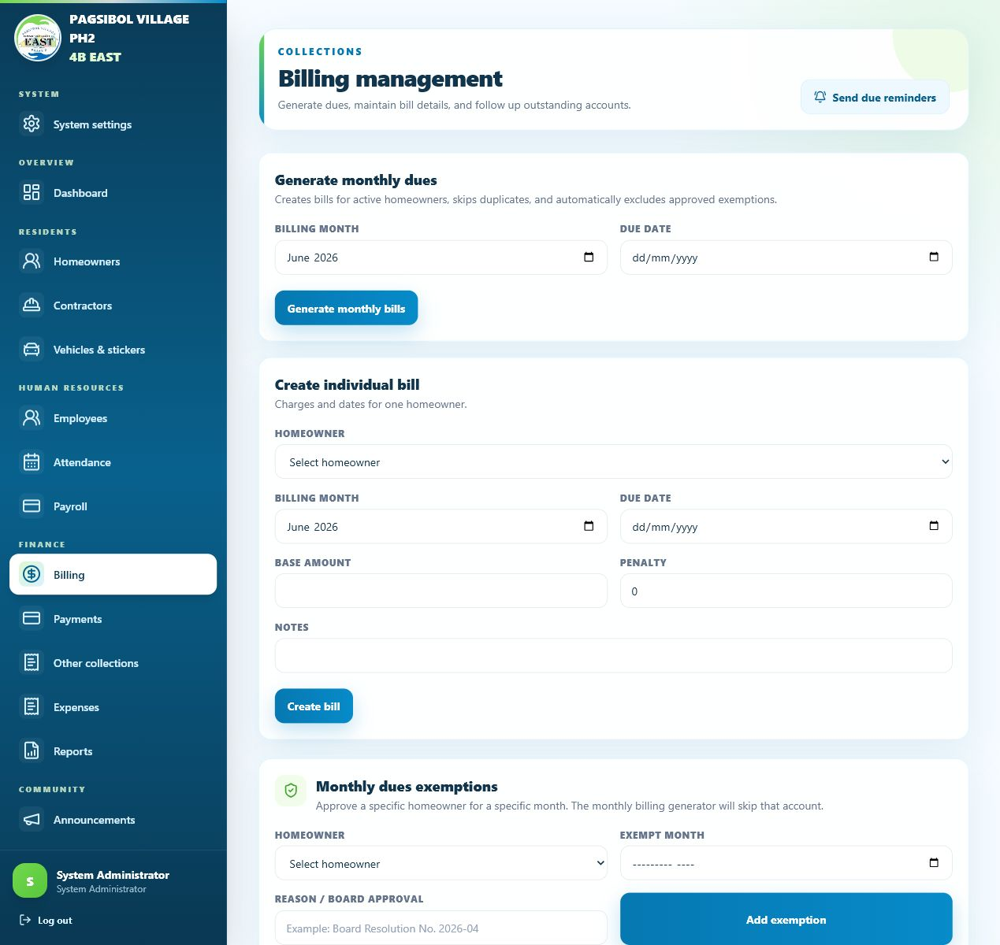

Admin can:

- Generate monthly dues for all active homeowners.
- Create an individual bill.
- Edit bill amount, penalty, due date, notes, and status.
- Mark bills as unpaid, partial, paid, or overdue.
- Add dues exemptions for homeowners who should not be billed for a specific month.

Suggested billing workflow:

1. Review active homeowner records and monthly dues amount.
2. Add exemptions first, if any.
3. Generate monthly bills.
4. Review created bills.
5. Send reminders for unpaid or overdue accounts.

## 7. Payment Recording and QR Requests

Open **Payments**.

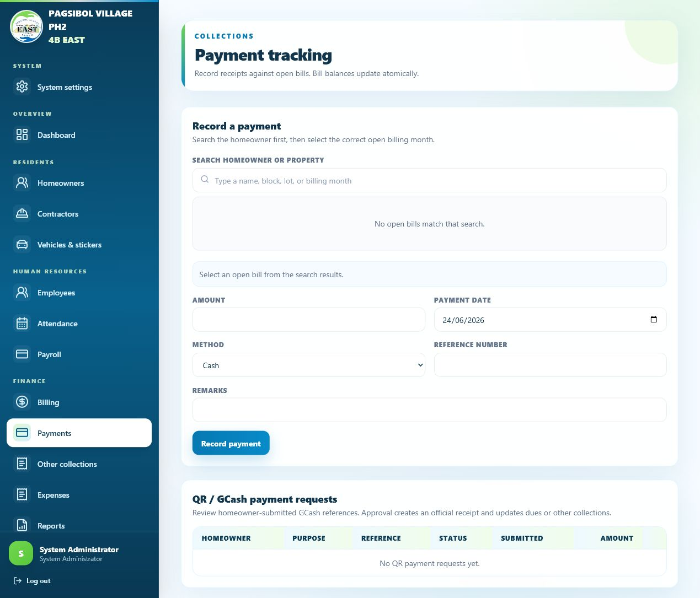

Admin can:

- Search homeowners while recording a payment.
- Select bill and enter payment date, amount, method, reference number, and remarks.
- Review QR/GCash submissions from homeowners.
- Approve valid submissions to create receipt and update balances.
- Reject invalid submissions with review remarks.

Payment methods include cash, bank transfer, GCash, check, and other.

## 8. Other Collections and Bonds

Open **Other collections** for non-monthly-dues income and refundable liabilities.

Supported types:

- Gate Pass
- Sticker
- Membership
- Construction Bond
- Contractor Bond
- Other

Construction Bond is refundable to the homeowner when construction is complete and there is no violation. Contractor Bond is refundable to the contractor and is linked to a contractor profile.

Admin can record refund, partial refund, or forfeiture according to HOA policy.

## 9. Contractor Profiles

Open **Contractors**.

Use contractor records for contractor bond collections. Each contractor can have company name, contact person, email, phone, address, license number, and active/inactive status.

## 10. Vehicle and Sticker Monitoring

Open **Vehicles & stickers**.

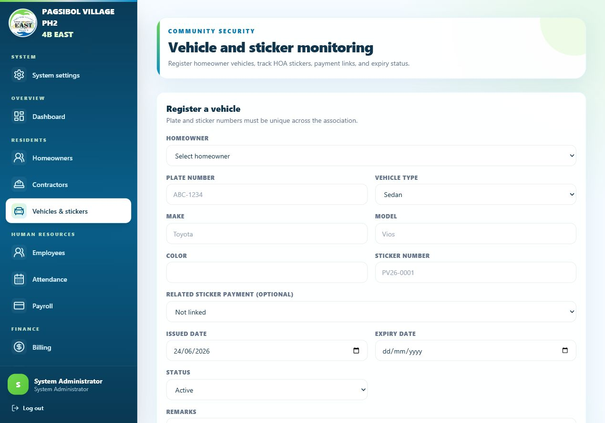

Admin can track:

- Homeowner
- Plate number
- Vehicle type
- Make, model, and color
- Sticker number
- Issue date and expiration date
- Status and remarks
- Sticker collection linkage

Homeowners can view their own vehicle and sticker records in the portal.

## 11. Employees, Attendance, Payroll, and Payslips

Authorized payroll users can manage employee profiles, effective-dated compensation, schedules, attendance, deductions/loans, leave, payroll periods, financial posting, and payslips. Employee users see only their own self-service records.

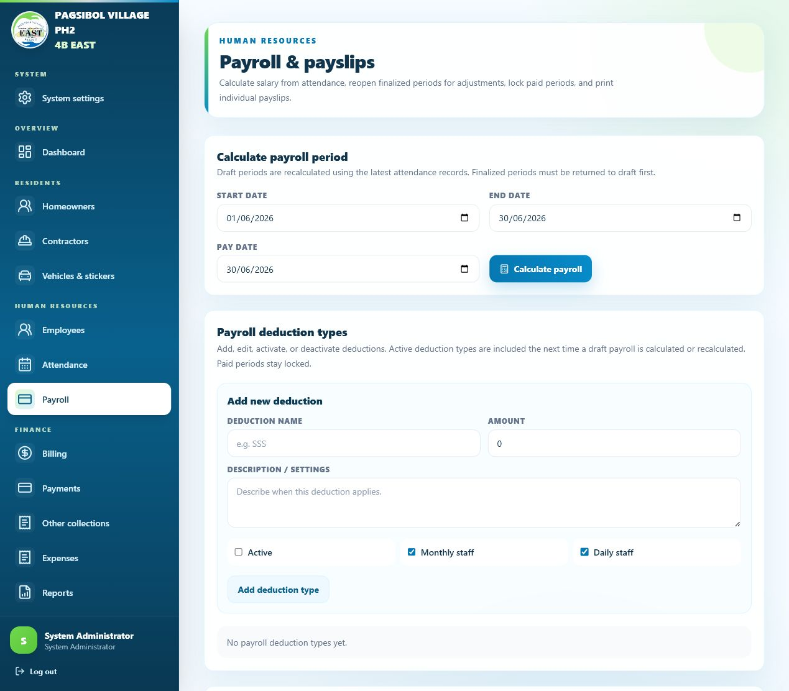

Payroll rules:

- Compensation basis, pay frequency, attendance policy, rate, standard workdays/hours, allowance, and fixed deduction are effective-dated. Saving changed payroll terms creates a new version instead of rewriting history.
- Generate/recalculate payroll to reach **CALCULATED**. Only Draft/Calculated working data may be edited; destructive deletion is Draft-only.
- Finalize only after review. Finalization creates an immutable numbered revision and locks ordinary attendance/deduction changes.
- A correction to finalized unpaid payroll requires a reason and creates a new child revision when re-finalized. The original revision remains unchanged.
- Select **Post to Financial Engine** to create the payroll accrual journal. Failed posting can be retried with the same idempotency identity.
- After the accrual reaches **POSTED**, select **Record net-pay disbursement** to create the cash journal, apply employee-loan deductions once, and reach **PAID**.
- Paid payroll remains locked. Reversal requires reasoned immutable reversal evidence and a separate authorized financial-reversal post.
- Statutory deductions/premiums are resolved from the effective Philippine rule set and shown as SSS, PhilHealth, Pag-IBIG, withholding tax, and employer contributions. The rule code/snapshot remains attached to payroll history.
- The Financial Engine reconciliation section shows POST/PAYMENT/REVERSAL status, idempotency key, errors, and journal lines.

Deduction types:

- Add new deduction type.
- Edit existing deduction type.
- Activate or deactivate deduction type.
- Configure deduction amount and whether it applies to daily or monthly employees.

Payslips are printable from payroll records.

### Leave management

Authorized Payroll Manager, HR Admin, or System Administrator users open **Leave management** to:

1. Review protected statutory leave types and their source authority.
2. Add/edit/deactivate custom tenant leave types. Protected statutory formulas cannot be edited or deactivated.
3. Review pending employee requests and supporting reference information.
4. Approve or reject with review remarks. Approval consumes the applicable balance and creates linked paid/unpaid attendance in one transaction.
5. Record reasoned positive/negative annual balance adjustments.

Employees open **Leave requests** to select an active leave type, choose dates, enter a reason/evidence reference, submit, see pending/approved/rejected/cancelled status, view applicable annual balances, or cancel their own pending request. HR review remains required for statutory eligibility. Requests that overlap finalized/posted/paid payroll cannot be approved directly.

### Payroll access summary

- Payroll Staff can prepare authorized payroll inputs but cannot gain employee self-service authority over another employee.
- Payroll Manager/System Administrator controls payroll configuration and approvals.
- Finance Approver participates in payroll financial approval/posting according to assigned Payroll Access.
- HR Admin can configure/review leave according to assigned leave authority.
- Employee login is owner-scoped to personal Time, timelogs/corrections, overtime, leave, paid payslips, and loans/cash advances.

## 12. Expenses

Open **Expenses**.

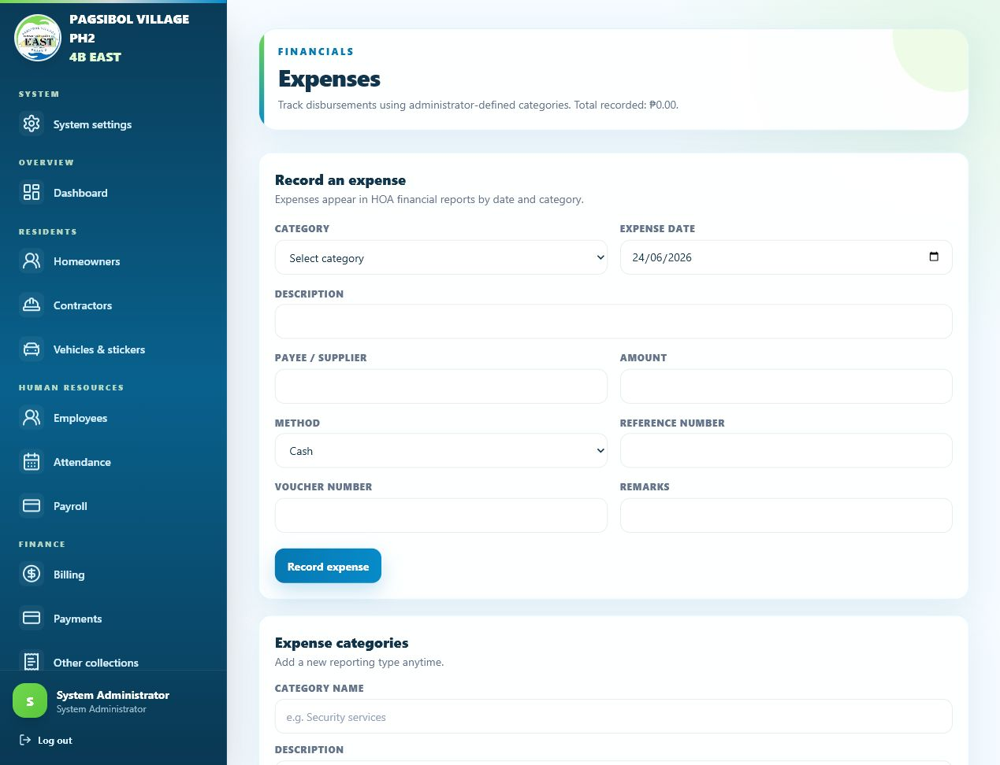

Admin can:

- Add expense categories.
- Activate or deactivate categories.
- Record disbursements with payee, amount, date, method, voucher number, reference number, and remarks.

Expenses are included in financial reporting.

## 13. Financial Reports

Open **Reports**.

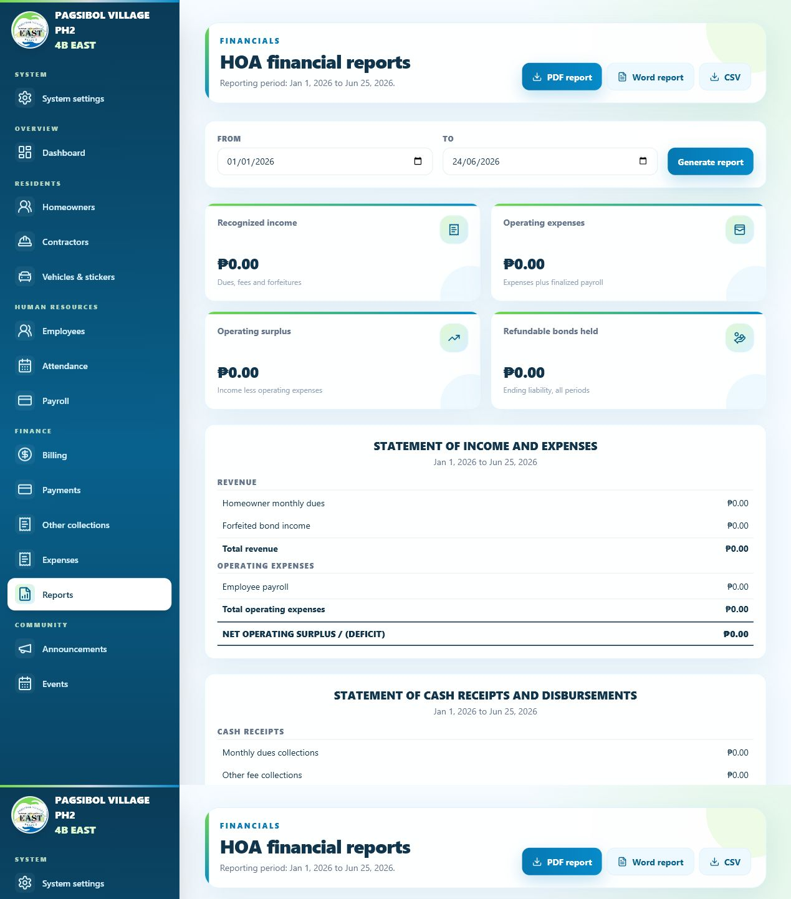

Reports can include:

- Statement of income and expenses
- Cash receipts and disbursements
- Receivables
- Bond accountability
- Posted payroll expense using gross pay plus employer contributions
- Paid net-pay cash disbursements

Admin can filter by date and export printable PDF, Word DOCX, and CSV where supported.

## 14. Announcements

Open **Announcements**.

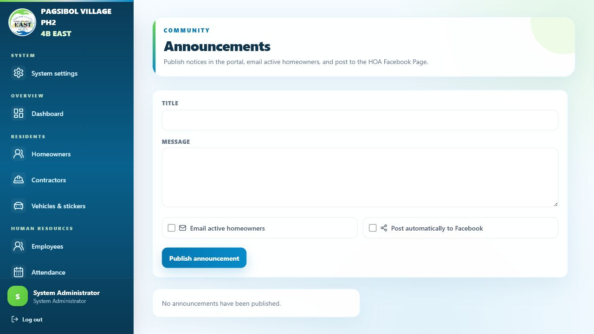

Admin can:

- Create, edit, and delete announcements.
- Send announcement emails when email settings are configured.
- Post announcements to the HOA Facebook Page when Facebook settings are configured.
- Review posting status.

Homeowners can view announcements in their portal.

## 15. Events

Open **Events**.

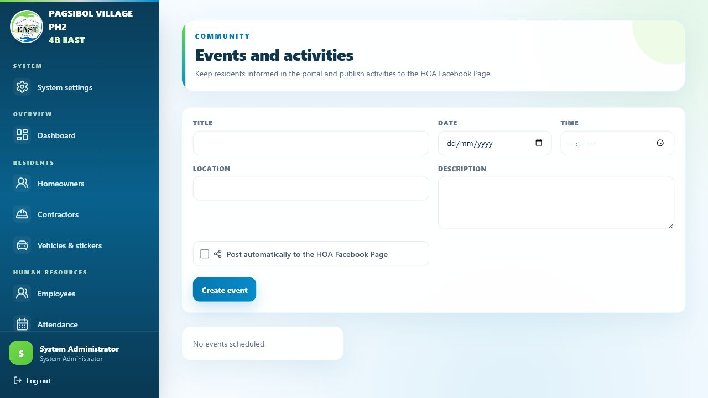

Admin can:

- Add title, description, date, time, and location.
- Edit or delete events.
- Post events to the HOA Facebook Page when configured.

Homeowners can view upcoming events.

## 16. Homeowner Portal

After an admin creates a homeowner profile and login account, the homeowner can access:

- Dashboard
- My profile
- My billing
- Pay by QR
- My payments
- Collections and bonds
- My vehicles
- Announcements
- Events

Homeowner rules:

- The homeowner sees only their own data.
- Pending dues appear under My billing.
- The Pay by QR page uses the configured GCash account and QR image.
- Payment submissions are pending until admin verification.

## 17. Mobile Use

The website is responsive. On smaller screens the sidebar becomes a hamburger menu.

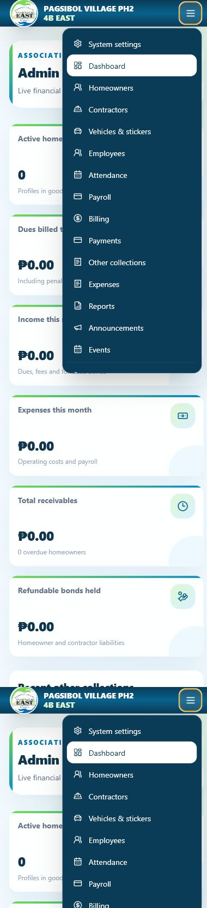

Mobile tips:

- Tap the menu icon to open navigation.
- Scroll tables inside their container when needed.
- Use large form fields and action buttons for touch input.

## 18. Receipts, Payslips, and Printable Documents

Printable outputs use the association profile settings:

- Association logo
- Association name
- Address
- Contact number
- TIN number

Common printable outputs:

- Official acknowledgement receipt
- Payroll payslip
- Financial report PDF
- Financial report DOCX

Print using browser print on A4 or Letter paper.

## 19. Recommended Daily Workflow

1. Check dashboard totals.
2. Add new homeowners, vehicles, contractors, employees, or events as needed.
3. Record daily payments and collections.
4. Review pending QR submissions.
5. Review attendance, overtime, and leave queues.
6. Calculate/finalize payroll, post its accrual, then record net-pay disbursement after actual payment.
7. Add expenses and vouchers.
8. Generate reports before officer meetings.
9. Back up database and documents regularly.

## 20. Screenshot Index

| Screenshot | Description |
| --- | --- |
| `screenshots/01-login-page.png` | Login page |
| `screenshots/02-admin-dashboard.png` | Admin dashboard |
| `screenshots/03-system-settings.png` | System settings |
| `screenshots/04-homeowners-list.png` | Homeowners list |
| `screenshots/05-new-homeowner-form.png` | New homeowner form |
| `screenshots/06-billing-management.png` | Billing management |
| `screenshots/07-payment-recording.png` | Payment recording |
| `screenshots/08-payroll-management.png` | Payroll management |
| `screenshots/09-expenses.png` | Expenses |
| `screenshots/10-financial-reports.png` | Financial reports |
| `screenshots/11-announcements.png` | Announcements |
| `screenshots/12-events.png` | Events |
| `screenshots/13-vehicles.png` | Vehicle monitoring |
| `screenshots/14-mobile-navigation.png` | Mobile navigation |
